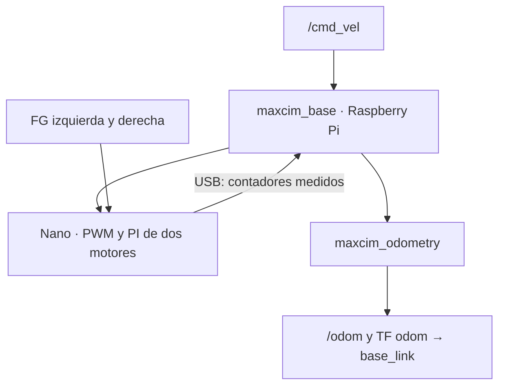

# MAXCIM · versión Linux

Repositorio `maxcim-base-linux`: control físico de motores y odometría con ROS 2.

Base diferencial para **Raspberry Pi + Arduino Nano clásico ATmega328P** y
dos motores BLDC3650 con controlador integrado, entrada PWM y realimentación FG.
Las dos ruedas motrices tienen ejes fijos y solo avanzan. El robot cambia de
orientación haciendo girar las ruedas a velocidades distintas.

Este proyecto contiene firmware físico, comunicación USB y odometría de pulsos.
Los valores de geometría, sentido y calibración están pendientes: no se han
medido estos motores ni probado el robot desde esta computadora. Al descargar,
las salidas permanecen bloqueadas hasta verificar el cableado.

## Qué movimiento permite

| Maniobra | Rueda izquierda | Rueda derecha |
|---|---|---|
| Avanzar recto | Misma velocidad lineal | Misma velocidad lineal |
| Curva a la izquierda | Más lenta | Más rápida |
| Curva a la derecha | Más rápida | Más lenta |
| Girar alrededor de la rueda izquierda | Parada | Avanza |
| Girar alrededor de la rueda derecha | Avanza | Parada |
| Retroceder o girar sobre el centro | Requeriría inversión | No admitido |

Los porcentajes PWM por sí solos no garantizan velocidades iguales: el PI del
Nano ajusta cada motor usando su FG. Se compara velocidad lineal de rueda, que
también depende del radio, no solamente RPM. Los apoyos adicionales del chasis
deben permitir el giro (por ejemplo, ruedas locas); dos motores unidos al mismo
mando PWM no pueden controlar la dirección de forma independiente.

Para una separación entre ruedas `L`, las consignas son:

```text
velocidad_izquierda = v - w*L/2
velocidad_derecha   = v + w*L/2
```

`v` va en m/s, `w` en rad/s. `w>0` gira hacia la izquierda. Se exige
`v >= abs(w)*L/2`. Si una rueda necesitara girar hacia atrás, se rechaza la
orden, se detiene la base y hay que habilitarla otra vez. Al superar el límite
de velocidad, ambas consignas se reducen proporcionalmente.

## Paquetes y flujo de datos



| Componente | Función |
|---|---|
| `firmware/maxcim_base_nano/` | PWM de 25 kHz, dos contadores FG, PI y watchdog de 350 ms. |
| `maxcim_interfaces` | Mensaje ROS 2 `WheelFeedback`. |
| `maxcim_base` | Identifica el Nano, recibe `/cmd_vel` y publica `/wheel_feedback`. |
| `maxcim_odometry` | Integra contadores FG y publica `/odom` y TF. |
| `scripts/nano_tool.py` | Identificación y prueba breve de una rueda, sin necesitar ROS. |

El puerto se elige explícitamente, preferiblemente por `/dev/serial/by-id/`.
No se usa automáticamente `ttyUSB0`, porque también puede ser la IMU o el LiDAR.
No hay rearranque automático del movimiento después de una desconexión.

## Empezar desde cero

Sigue **[docs/PUESTA_EN_MARCHA.md](docs/PUESTA_EN_MARCHA.md)** en orden. Incluye:

1. Reconocer el sistema instalado y preparar ROS 2.
2. Conectar dos motores independientemente con el Nano.
3. Cargar primero el firmware bloqueado y verificar su identidad.
4. Probar cada rueda, comprobar FG y medir la calibración.
5. Compilar los paquetes y comprobar el movimiento y `/odom`.

La tabla de conexiones está en [docs/CONEXIONES.md](docs/CONEXIONES.md).
Los detalles del firmware están en [firmware/README.md](firmware/README.md).
El formato serie está en [docs/PROTOCOL.md](docs/PROTOCOL.md).

## Qué mide la odometría

El recorrido de cada rueda es `incremento_FG * 2*pi*radio / pulsos_por_vuelta`.
La diferencia entre recorridos estima el giro; el promedio estima el avance.
Se usa integración de arco y el tiempo de adquisición del Nano.

**La odometría nunca se calcula a partir del movimiento solicitado.** Sin FG
reciente no se publican muestras nuevas de `/odom` ni TF. Se validan CRC,
sesión, secuencia, tiempos y saltos físicamente incompatibles.

FG tiene un solo canal: el signo se basa en haber confirmado físicamente que
cada rueda solo avanza. No se puede reconocer un empuje hacia atrás, derrape o
rueda levantada usando FG solo. Después de perder intervalos, la pose se
conserva, pero el recorrido perdido es desconocido: no usar esa pose como si
no hubiera ocurrido la pérdida. Reinicializar/localizar antes de navegación.

## IMU y LiDAR

Este repositorio implementa la base y su odometría. Los drivers de sensores
permanecen en [robot-sensors-ros2-jetson](https://github.com/VillenetMK/robot-sensors-ros2-jetson).
Aquí no se ha configurado todavía fusión con IMU, SLAM ni navegación autónoma.
Para integrarlos: deben compartir reloj/ROS_DOMAIN_ID, y los frames de IMU y
LiDAR deben conectarse a `base_link` con las medidas físicas de sus soportes.
Solo un nodo debe publicar `odom → base_link`: si después lo publica un EKF,
usar `publish_tf: false` en la odometría de ruedas. No asumir obstáculos
evitados por el mero hecho de tener `/scan` disponible.

## Verificación del software

```bash
bash scripts/check.sh
```

Incluye pruebas Python de cinemática, protocolo, caducidad, callbacks del puente
y odometría, más pruebas nativas del núcleo C++ del Nano. La compilación AVR
real también se verificó durante la preparación. Ver [docs/VALIDACION.md](docs/VALIDACION.md).

La integración ROS real se prepara en GitHub Actions (Humble/Jazzy) con un
Nano emulado en un pseudo-terminal; no mueve hardware. Esta prueba no sustituye
las mediciones y pruebas del robot.

## Fuentes técnicas

- [Arduino Nano clásico y documentación](https://docs.arduino.cc/hardware/nano).
- [Pinout oficial del Nano](https://content.arduino.cc/assets/Pinout-NANO_latest.pdf).
- [Temporizadores y PWM de Arduino](https://www.arduino.cc/en/Tutorial/SecretsOfArduinoPWM).
- [Control diferencial y odometría con realimentación en ROS 2](https://control.ros.org/humble/doc/ros2_controllers/diff_drive_controller/doc/userdoc.html).
- [Ficha de señales aportada por el usuario](https://github.com/VillenetMK/robot-mobility-ros2-jetson/blob/main/docs/hardware/fg_pinout.jpg).

La ficha identifica una familia de motores, no confirma la tensión, reducción,
pines actuales ni velocidad de las dos unidades instaladas.

## Versiones separadas

El panel de escritorio se mantiene en el proyecto independiente `maxcim-base-windows`.
Ambas versiones incluyen una copia del mismo firmware y del protocolo serie v1.
Solo una aplicación puede abrir el USB del Nano a la vez.

Origen del código: separación del proyecto local `maxcim-base-ros2`, commit
`4987d04`. Esta versión tiene su propio historial Git.
